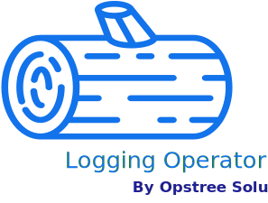

<p align="left">
  
</p>

[](https://circleci.com/gh/OT-CONTAINER-KIT/logging-operator/tree/master)
[](https://goreportcard.com/report/github.com/OT-CONTAINER-KIT/logging-operator)
[](https://quay.io/repository/opstree/logging-operator)
[](LICENSE)
[](https://codeclimate.com/github/OT-CONTAINER-KIT/logging-operator/maintainability)


## Logging Operator

A golang based CRD operator to setup and manage logging stack (Elasticsearch, Fluentd, and Kibana) in the Kubernetes cluster. It helps to setup each component of the EFK stack separately.

> The K8s API name is "logging.opstreelabs.in/v1alpha1"

Our roadmap is present in [ROADMAP](ROADMAP.md)

### Supported Features

The "Logging Operator" includes these features:-

- Elasticsearch different node types, like:-
  - Master Node
  - Data Node
  - Ingestion Node
  - Client/Coordinator Node
- Elasticsearch setup with/without TLS
- Customizable elasticsearch configuration and Heap size
- Fluentd as a log-shipper which already has JSON logs support
- Kibana integration with elasticsearch for logs visualization
- Seamless upgrade for Elasticsearch, Fluentd, and Kibana
- Inculcated best practices for Kubernetes setup like `SecurityContext` and `Privilege Control`
- Loosely coupled setup, i.e. Elasticsearch, Fluentd, and Kibana can be setup individually as well.

### Architecture

<div align="center">
    
</div>

### Purpose

The purpose behind creating this CRD operator was to provide an easy and yet production grade logging setup on Kubernetes. But it doesn't mean this can only be used for logging setup only.

> This operator blocks Elasticsearch, Fluentd, and Kibana are loosely-couples so they can be setup individually as well. For example:- If we need elasticsearch for application database we can setup only elasticsearch as well by using this operator.

### Prerequisites

The "Logging Operator" needs a Kubernetes/Openshift cluster of version `>=1.8.0`. If you have just started using Operatorss, it's highly recommended to use the latest version of Kubernetes.

The cluster size selection should be done on the basis of requirements and resources.

### Logging Operator Installation

For the "Logging Operator" installation, we have categorized the steps in 3 parts:-

- Namespace Setup for operator
- CRD setup in Kubernetes cluster
- RBAC setup for an operator to create resources in Kubernetes
- Operator deployment and validation

#### Namespace setup

Since we are going to use pre-baked manifests of Kubernetes in that case we need to setup the namespace with a specific name called "logging-operator".

```shell
kubectl create ns logging-operator
```

#### CRD Setup

So we have already pre-configured CRD in [config/crd](./config/crd) directory. We just have to run a magical `kubectl` commands.

```shell
kubectl apply -f config/crd/
```

#### RBAC setup

Similar like CRD, we have pre-baked RBAC config files as well inside [config/crd](./config/rbac) which can be installed and configured by `kubectl`

```shell
kubectl apply -f config/rbac/
```

#### Operator Deployment and Validation

Once all the initial steps are done, we can create the deployment for "Logging Operator". The deployment manifests for operator is present inside [config/manager/manager.yaml](./config/manager/manager.yaml) file.

```shell
kubectl apply -f config/manager/manager.yaml
```

### Deployment Using Helm

For quick deployment, we have pre-baked helm charts for logging operator deployment and logging stack setup. In case you don't want to customize the manifests file and want to deploy the cluster with some minimal configuration change, in that case, "Helm" can be used.

```shell
helm upgrade logging-operator ./helm-charts/logging-operator/ \
  -f ./helm-charts/logging-operator/values.yaml --namespace logging-operator --install
```

Once the logging operator setup is completed, we can create the logging stack for our requirement.

```shell
helm upgrade logging-stack ./helm-charts/logging-setup/ \
  -f ./helm-charts/logging-setup/values.yaml --set elasticsearch.master.replicas=3 \
  --set elasticsearch.data.replicas=3 --set elasticsearch.ingestion.replicas=1 \
  --set elasticsearch.client.replicas=1 --namespace logging-operator --install
```

### Examples

All the examples are present inside the [config/samples/](./config/samples/) directory. These manifests can be applied by the `kubectl` command line. These configurations have some dummy values which can be changed and customized by the individuals as per needs and requirements.

### Contact Information

This project is managed by [OpsTree Solutions](https://opstree.com). If you have any queries or suggestions, mail us at opensource@opstree.com
