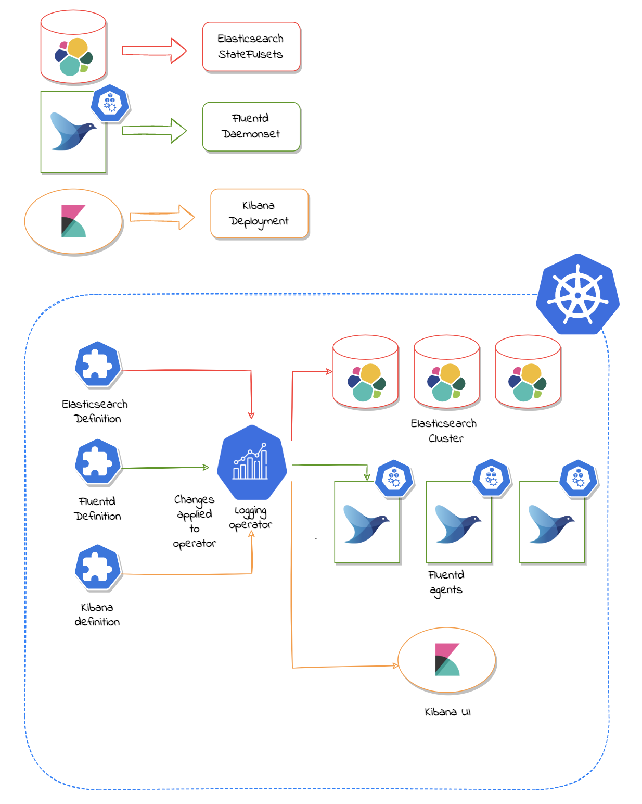

<p align="center">
  
</p>

<p align="center">
  <a href="https://dev.azure.com/opstreedevops/DevOps/_build/latest?definitionId=8&repoName=OT-CONTAINER-KIT%logging-operator&branchName=master">
    
  </a>
  <a href="https://goreportcard.com/report/github.com/OT-CONTAINER-KIT/logging-operator">
    
  </a>
  <a href="http://golang.org">
    
  </a>
  <a href="https://quay.io/repository/opstree/logging-operator">
    
  </a>
  <a href="https://github.com/OT-CONTAINER-KIT/logging-operator/master/LICENSE">
    
  </a>
</p>

Logging Operator is an operator created in Golang to set up and manage EFK(Elasticsearch, Fluentd, and Kibana) cluster inside Kubernetes and Openshift environment. This operator is capable of setting up each individual component of EFK cluster separately.

For documentation, please refer to [https://ot-logging-operator.netlify.app/](https://ot-logging-operator.netlify.app/)

## Architecture

Architecture of logging operator looks like this:-

<div align="center">
    
</div>

## Purpose

The aim and purpose of creating this Logging Operator to provide an easy and extensible interface to setting up logging stack such as EFK(Elasticsearch, Fluentd, and Kibana). It helps in setting up different nodes of elasticsearch cluster, fluentd as a log shipper and kibana for visualization.

## Supported Features

- Setup of elasticsearch cluster with different nodes type:- master, data, ingestion, and client.
- Customizable configuration for elasticsearch, fluentd stack.
- Setup of fluentd as light-weight log-shipper as Daemonset.
- Kibana will be set up as visualization tool for elastic stack.
- Seamless upgrades of elasticsearch, fluentd, and kibana.
- Security best practices support for complete stack such as TLS, elastic security.
- Kubernetes resources objects support like:- resources, securityContext, affinity, tolerations, etc.

## Prerequisites

Logging Operator requires a Kubernetes cluster of version `>=1.16.0`. If you have just started with the CRD and Operators, it is highly recommended using the latest version of Kubernetes cluster.

## Getting Started

If you want to start using the logging-operator in a quickstart mode, you can begin with the [documentation](https://ot-logging-operator.netlify.app/). It will help you and guide you through the setup of Elasticsearch, Fluentd, and Kibana  step-by-step.

The configuration for EFK (Elasticsearch, Fluentd, Kibana) set up is defined inside the CRD manifests. But all the examples manifests can be found in the [example](./examples) directory.

## Quickstart

### Logging Operator Setup

The setup can be done by using helm. The logging-operator can easily get installed using helm commands.

```shell
# Add the helm chart
$ helm repo add ot-helm https://ot-container-kit.github.io/helm-charts/
...
"ot-helm" has been added to your repositories
```

```shell
# Deploy the Logging Operator
$ helm upgrade logging-operator ot-helm/logging-operator \
  --install --namespace ot-operators
...
Release "logging-operator" does not exist. Installing it now.
NAME: logging-operator
LAST DEPLOYED: Sun May 29 01:06:58 2022
NAMESPACE: ot-operators
STATUS: deployed
REVISION: 1
```

After the deployment, verify the installation of operator.

```shell
# Testing Operator
$ helm test logging-operator --namespace ot-operators
...
NAME:           logging-operator
LAST DEPLOYED:  Sun May 29 01:06:58 2022
NAMESPACE:      ot-operators
STATUS:         deployed
REVISION:       1
TEST SUITE:     logging-operator-test-connection
Last Started:   Sun May 29 01:07:56 2022
Last Completed: Sun May 29 01:08:02 2022
Phase:          Succeeded
```

## Upcoming Features

- Plugins support for elasticsearch and kibana
- Plugins support for fluentd
- Index template support in operator
- Index lifecycle support in operator

## Contact

This project is managed by [OpsTree Solutions](https://opstree.com/). If you have any queries or suggestions, mail us at [opensource@opstree.com](mailto:opensource@opstree.com).

